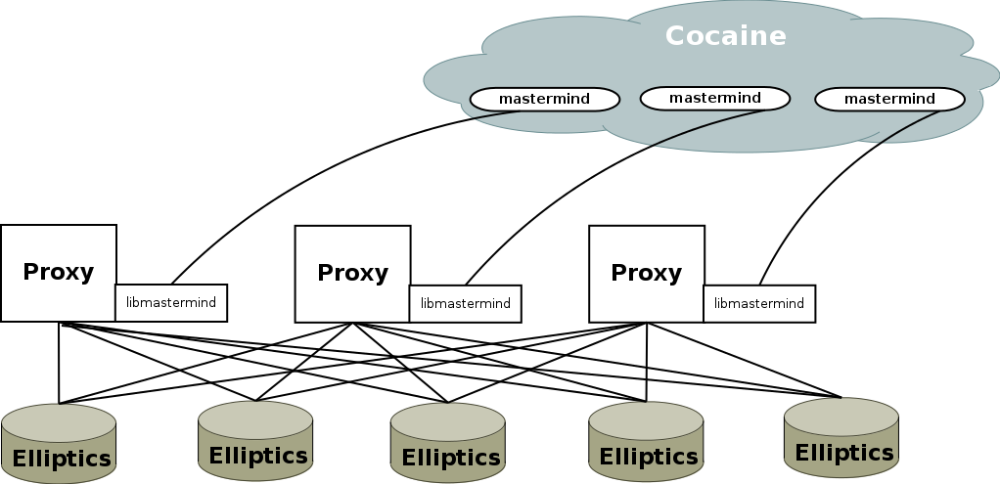
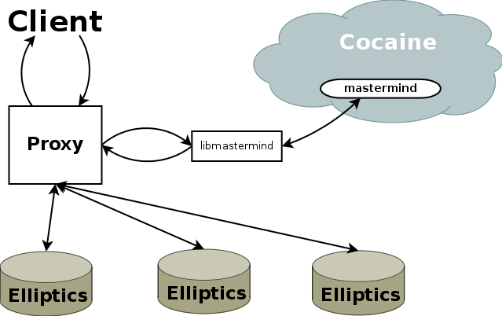

#Mediastorage-proxy сonfiguration 

The general scheme of relationship the proxy with other components is shown below.



Running Mediastorage-proxy as follows:

1. start proxy,
2. start *libmastermind*,
3. *libmastermind* load cache,
4. *libmastermind* connect to Mastermind in Cocaine,
5. gets namespace sitting from Mastermind and send it to proxy,
6. proxy load.

The scheme of work Mediastorage-proxy with the client.



The scheme of work at upload operation.

1. The client transmits to proxy the following parameters - key, value and namespace.
2. Proxy transmits to *libmastermind* namespace, size.
3. *Libmastermind* transmits to proxy a value of couple.
4. Proxy upload the data to Elliptics in accord a value of couple.
5. Proxy send to client a value of couple (if operation was successful) or an error message (if operation was successful and delete data in those groups, in which all the same managed to upload). 

The scheme of work at read/delete a data operations.

1. The client transmits to proxy the following parameters - key name, namespace and couple with the number of group.
2. Proxy transmits to *libmastermind* a value of couple with the number of group.
3. *Libmastermind* transmits to proxy a value of couple.
4. Proxy delete or read the data to Elliptics in accord a value of couple.
5. Proxy send to client a data in read operation or a message on the status of delete operation.

Proxy provides HTTP API to the client with the help TheVoid. Access to Elliptics gives by using libmastermind and client interface of Elliptics. Configuring proxy is logically divided to configuring TheVoid and installing other configuration parametrs. The configuration file has JSON format.
The overall structure of the configuration file is as follows:
```
{
"thevoid":{},
"application":{}
}
```
Where are:
* `thevoid` section - TheVoid sittings;
* `application` section - other configuration parametrs.

##TheVoid settings
```json
        "endpoints": [
                "unix:/tmp/thevoid/mediastorage-proxy.sock",
                "0.0.0.0:8082"
        ],
        "backlog": 128,
        "safe_mode": true,
        "threads": 2,
        "buffer_size": 65536,
        "daemon": {
                "monitor-port": 20001
        },
```
| Parameter | Description |
|-----------|-------------|
| endpoints | The sockets that proxy listens. Unix and tcp sockets can be used. |
| backlog | Size of queue for each socket. |
| safe_mode | This option catches all uncaught errors and return 500 code of error, if the value this parameter is TRUE. |
| threads | Number of threads to handle connection. |
| buffer_size | Buffer size of matching packages. |
| monitor-port | Port value for monitoring proxy. |
##Mediastorage-proxy settings
```json
		"application" : {
                "elliptics-log" : { 
                        "path" : "/tmp/log/mediastorage/elliptics.log", 
                        "level" : 2
                },
                "proxy-log" : {   
                        "path" : "/tmp/log/mediastorage/proxy.log", 
                        "level" : 2 
                },
                "mastermind-log" : { 
                        "path" : "/tmp/log/mediastorage/mastermind.log", 
                        "level" : 2 
                },
                "timeouts" : {  
                        "wait" : 30, 
                        "check" : 60 
                },
                "cfg-flags" : 4, 
                "remotes" : [ 
                        "elisto24f.dev.yandex.net:1025:2"   
                ],
                "elliptics-threads" : {  
                        "io-thread-num" : 16, 
                        "net-thread-num" : 4  
                },
                "mastermind" : { 
                        "nodes" : [    
                                {
                                        "host" : "indigo.dev.yandex.net",   
                                        "port" : 10053  
                                }
                        ],
                        "group-info-update-period" : 10  
                },
                "die-limit" : 1, 
                "eblob-style-path" : true,
                "base-port" : 1024,
                "chunk-size" : { 
                        "write" : 10, 
                        "read" : 10
                }
        }
```
| Parameter | Description |
|---------------|-------------|
| elliptics-log </br> proxy-log  </br> mastermind-log | There are Elliptics client, proxy and *libmastermind* logs. Should be set the path to the log-file and the log level (value can be from 0 to 5). |
| [timeouts](#timeouts) | The timeouts settings. |
| cfg-flags | Configuration fldoiags of the Elliptics client. |
| remotes | The nodes of Elliptics storage. A string address in the format - “host:port:family". |
| [elliptics-threads](#elliptics-threads) | Configuration of the Elliptics client threads.  |
| [mastermind](#mastermind) | Configuration for the *libmastermind*. |
| die-limit | Sets how many live connections between Mediastorage-proxy and Elliptics that to assume that the system is operable. But it is impossible make a record if the the system contains fewer connections because it works in read-only mode. |
| eblob-style-path | If the value is 1 that's eblob, else - if the value 0. |
| base-port | The value for Dnet base port. Style specifying to a file path: if the value "1" - eblob, else - filesystem. |
| chunk-size | A size of a single piece of data to be written or to be read. The size is specified in MB. It is a required parameter. |

###timeouts
Allow you to override at runtime the previous values for timeouts.
* *wait* - a time to wait for the operation complete,
* *check* - sets the wait for a response from the host. If it stops responding then rebuild the routing table.

###elliptics-threads
The following parameters are used to configure the client:
* *io-thread-num* -  a number of IO threads in processing pool,
* *net-thread-num* - a number of threads in network processing pool.

###mastermind
Allows to communicate the mediastorage-proxy with Mastermind in Cocaine. Mastermind calculates the load on the nodes.  It lets say what the nodes are most loaded and where should be the load on nodes for write operations. To configure the client are using the following parameters:
* *nodes* - paths to all the Cocaine locators that can go to Mastermind (values for a path to the cocaine-runtime and for a port where is the locator),
* *group-info-update-period* - a time after which should be updated the information (this parameter in seconds).
