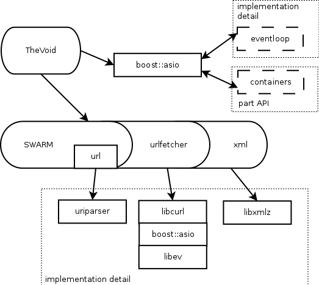

#SWARM&TheVoid
This is a set of containers - http_headers, http_request, http_response, Url, url_query. There are containers with a set of fields (exept URL), in case http_headers container which consisting of a list of key - value. 

URL - a special class that represents the API to work with links. It uses for working the libcurl library. Every time when called a seturl method or constructor, it saved an original `cURL` at the internal structure in a special field. On the first request produced lazy initialization  to any of the fields except this `cURL` (other than the original field). That is, called a special methods from libcurl to parse which came the line, to check its validity and then put in the fields. When calling to_string method occurs a lazy parsing a URL (if you haven't done so already), then use libcurl methods after what made generation from units. 
Parsing in libcurl is a very strict, it does not allow to be any deviation. So, if in url is something wrong, it is considered invalid. The fromuserinput method was made for url, which was entered by the user or from an external application. It verifies the url and try to make valid. If unable to do it, returns FALSE. 

##SWARM_XML library

The goal of this class is get the input xml and return a list of url. The goal of this class is get the input xml and return a list of url. Currently used in xmlpath. It uses a special API to parse html documents. It searches for all the tags that return url and adds its contents to the list of url (without any manipulation). 

###API features
urlfetcher is a wrapper over liburl with the properties:
@eventloop - a special object that allows you to manage and monitor various events associated with timers and input-output devices. In particular, there is a class eventloop, which is an abstraction over @eventloop (based boost_asio and libev). It should create a socket with specified types of network domain, protocol (to be able to close), listen to the events of the socket - read operations, write operations, request call timer. Libev - more or less canonical library, on which basis was tested URL. From libev library uses a timer, async, ev_ill. Whenever the url invokes the command, it wants to listen to these events. It checks whether created for this socket ev_ill, if not - it creates. If you ask it to kill - it kills.

The `cURL` may ask to stop listening socket at eventloop, or listen to it read-only or write-only , or read and write. When it says to do something new, it must forget everything talking about ever before. We considered a normal `cURL` - call it at the specified socket, there is some action, it calls inside these does something, and then ask to close this socket. Here arise problems - what you need to remember that bad to kill within a method that finds. It destroys the stack.

When `cURL` asks eventloop create a timer, you should not forget about all the previous timers. Previous timers it forgets and calls only the last.

Host- `cURL` it himself never calls, but is necessary for reasons based on the `cURL` is not multithreaded. Api all that it has to be guaranteed called from the same thread. Now because of this surfaced strange problems when working with the `cURL` in different streams within each stream was created their instance `cURL` and had frequent requests https this leads to accidental drops inside openSSL.

ev_eventloop timer uses when requesting evtimer, when requesting to post event is used ev-async + special queue of callbacks. When a thread of the stream we want to call the new method then blocked list of callbacks. Then variant - a new event, and then write the log, and then tell it to async something do. Then it will call evlibev special callback in its stream that will run through all the events and all will be called in turn.

###Especially the use of third-party libraries

Boost_asio developers did not try to cross to `cURL`. The first problem - if you take the old version of `cURL`, there `cURL` could not ask eventloop create its socket or kill the socket, it has always created his avd and it passed. Boost library can not work with the avd and just allow to work with it, the library requires that owned it. Therefore boosteventlop has to create a copy of that the avd and to work with her. It retains all the properties of the parent, except that `cURL` does not close the socket for it. Need to close both avd to closed the socket. When `cURL` is requesting to hang some event on the socket, then evenlupe need to check what we know about this awd or see it for the first time. If the first time, it should duplexes it and create a boost socket. If you know, then take out the existing sockets created a boost socket and hang it on the event to listen. In later versions, we can listen to `cURL`, there are methods to create, open socket, then we can immediately create the boost socket, and `cURL` give any AVD for which can be uniquely identified the boost socket. This greatly simplifies things. Due to this, required to check implementations the boost eventloop in both cases.

When `cURL` requests to listen socket for reading, it actually asks you do not say when it will be read from this socket in the near future, from now on, it says always in the socket when there are new data. It reads in the paradigm libev library, but quite contrary boost_asio library. When boost_asio library can read the data - it calls once, and then again need to push over data. Libev library asks to close the socket inside the call this socket. Always needs to remember the last of its condition what it asked to do with this socket.This imposes certain restrictions on how to prolong the life of this socket. That is, when we ask to stop listening socket, we should stop listening to him but not to close and not to say to `cURL` any data from this socket. But at other times, when you call the close, we can not close it instantly because it can be inside a call to this socket.Every time when we are asked to create a socket , we create its shared pointer. We're losing it at closing the socket. In all treatments of the socket we take shared pointer and something doing with it. When event is called that we read the new data and need to remember a weak pointer. Then check the socket is not dead (that is a weak pointer Null or not Null) when the event is called. Trying transfer shared pointer and if it done, we can do something. This gives a more stable job with `cURL`. That is socket kills only when we are asked to kill, and all the events that arrive after that check whether they are a socket or not. 

Post events to the eventloop stream are produced through the usual method of despatch from ioservice. Timer made through deadlinetimer boost_asio liblary and in it for each request timer must cancel a previous request and then make a new request. Tht `cURL` can ask to call it in 0 seconds sometimes. We should call as soon as possible, but not right now. Usually this is done so in boost_asio - into the event queue put a `cURL` call a new event and it will be caused by itself, when it returns to eventloop. That is already coming out of `cURL`, coming from all methods, leave everywhere, then take out the event from eventloop we call the appropriate `cURL` method. 

Urlfetcher tying itself over `cURL`. Problem - `cURL` single-threaded, and events from urlfetcher would like to throw in another thread. So each call of get and post methods that has accompanied this dispatch call eventloop in running `cURL`. Inside urlfetcher can not work with any libev or boost_asio library. When it comes to some event of the arguments get or post formed a special event structure and sends handle of this event structure into a stream eventloop. Next, try to create a `cURL` request for this request. Create `cURL` object for processing this request. After convert our representation into lists of header of `cURL`. Attached data (if post) and the data from `cURL`, but `cURL` does not copy the data. Therefore requires to put somewhere this line of data that not to lose. After should to convert `cURL` in line and transmit `cURL`, redefine a commands to create the socket, to close the socket, redefine callbacks, which tells us from `cURL` that came header and a data.

Next, tries to create an cURL-easy object, add it to cURL-multi object and it will tell us whether it has create or not. If do not do it, throw an error. For this is using callinforedirectcount (?) - special field that says how many times the `cURL` got redirects. If the number is changes, that try to deceive us and we are in the following request. Then it need to forget about all that headers are arrived and again begin to fill some sort of fields. In this, we do not know that it was the last line with the header.

We need to know the error code, that the headers is ended and then can to call some user method. Therefore, it is verified that came the two values of /n. 

End of request processing - the `cURL` has a special message queue which need to check from time to time. There may be any messages, but now stored only the completion message of the query. Depending on the message you can send a message about the status of the query to the user. After that will killed itself cURL-easy  object and carefully pull out of its cURL-multi object. So it's all consistent with the idea of `cURL` and nothing was destroyed. If you've finished processing the event. In urlfetcher have another special property - we can send many simultaneous requests. But cULR can not do it. Therefore, there is a check on the amount of active compounds - the number of simultaneous requests. And at the end, when we processed next message - it is necessary to check whether we can send the next request. For this supported the special request queue, which has not yet been able to send because there is a limit. This bypasses the trouble to work with `cURL`.

##TheVoid

The main work of the program is as follows. TheVoid has a special object (it names the `serv`), which contains information about a handle of the users and the server. The handle is a structure that defines a set of properties when they should be called. The handle is a structure that defines a set of properties when they should be called. And there exists a factory that constructs the object. It is engaged a request processing. Also the server monitors a listening socket that they were raised. It serves all connections included in them. TheVoid has a special method that returns some data for monitoring. 

Server does not contain virtually no data. It has a method that adds a factory for queries and has a list of open listening sockets. All the listening sockets are of three types: 
- a tcp socket, 
- an unix socket, 
- a special monitoring socket.

The first and second types of sockets are the same that it listening a socket type. The first and second types of sockets are the same, like a type of listening socket. The third type is to give the monitoring data. It does not support http. The server takes from configuration the number of threads that need to be raised to processing of requests. When a listening socket understands that came a new request it receives socket. And creates a special object - `connection`, which is engaged in processing this socket.
Dronedropping (???) determines which of worker threads will always be engaged in the future processing of this socket. And transmits a different name.

This object is busy that reads socket, parses them. And as soon as it receives a list of header (all from the client request body, except its http body), path, weight, http and type of request, it can understand which handle can processing this query. If this handle exists, it refers to the respective farm and creates an object handle. Then passes this list of header and begins to transmit data, which then sends the client. If the handle is not present, responds to the client with 404 and reads all the data from the socket. This is required because there is http v1.1 and within the same connection on a socket can serve many requests. They will just send in turn. It is much cheaper than each time to create a tcp connection.

How does work connection itself - reads a data from the socket and gives a special parser http.  It parses the requests by the lines. It reads whole line and then processed. If this is the first line, it cuts method, path, version of http. In all the other lines gets the key and value header, then waits another line. If it is return a blank line (ie \n\n), then the work ends. connection as soon as it gets header creates a handle. And starts give everything to the handle. As soon as said that the handle could not take all data - starts no longer listen socket for reading. Second variant - the handler can tell that it is ready to read the data from a certain point when it all read from the client (the size of the buffer that was created when you connect to the client - by default 8K regulated in config). Then we give all the data that we have and waiting for the next batch of data. Starts again read the data from the socket. At some point, it may happen that started coming a strange data. Then you can just take and break the connection to the socket. Then the client on the other side will understand that everything was bad and he needs to resend the request. Connection provides a number of methods that can cause handler outside. It is important to understand that the connection is always live in the same thread and events from boost::asio always come from the same thread, but external requests can come from any thread. Therefore, all methods that cause handler, they should be safe, lest there be anything wrong with that. On the other side if it calls these methods from the correct thread, we would not want to give extra overheads too. Therefore, in most cases used a dispatch from the service (either immediately or put in a queue). The server always adds keepalive to all requests that all worked optimally, if the client supports (it adds optimality). If the client can not support then will break socket. All data which handler provides on write operation are transmitted in a special thread-safe queue and  to the socket will be writing as much data at a time. Formed lightweight array of boost::asio buffer and it sending to write to the socket. After some time, the socket returns a message that how many managed to record data. This size of the data are removing and then continue to try to write a remaining data.
To parse incoming messages used primitive machine which has several states: 1 - read header, 2 - now read the data and 3 - we finished sending data from the client (substate may be here and there).

Monitor connection is a simple listening socket for monitoring. When comes any request then given a new socket. On this socket reads first post and on it is determined that you need to do - display a help, change the server, return information. This socket is filled response asynchronously. 

In TheVoid is supported demonization - if in the command line or in the config file specified that we should demonized and there is the path where we should put the file, then when started created this file and when stopping the server, we should remove. This process occurs after the user has read configs.

